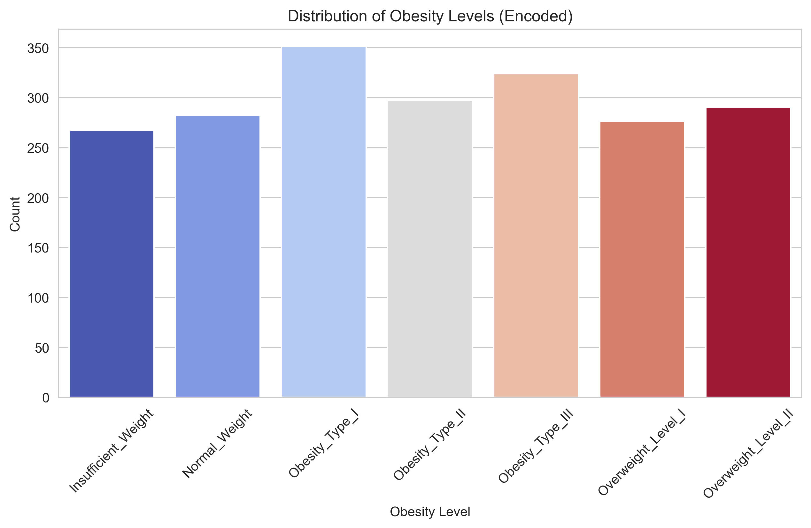
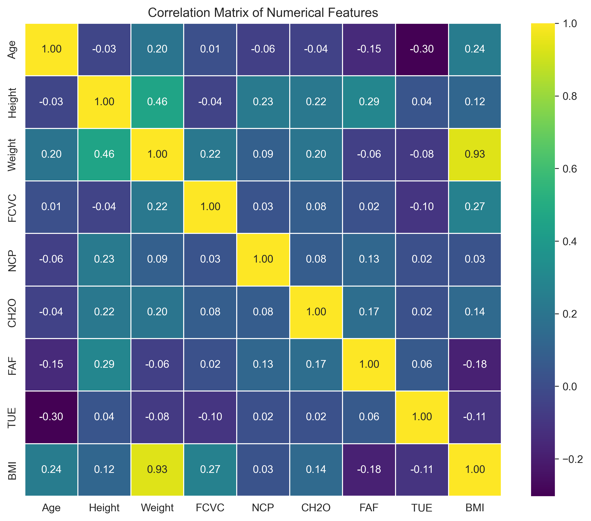
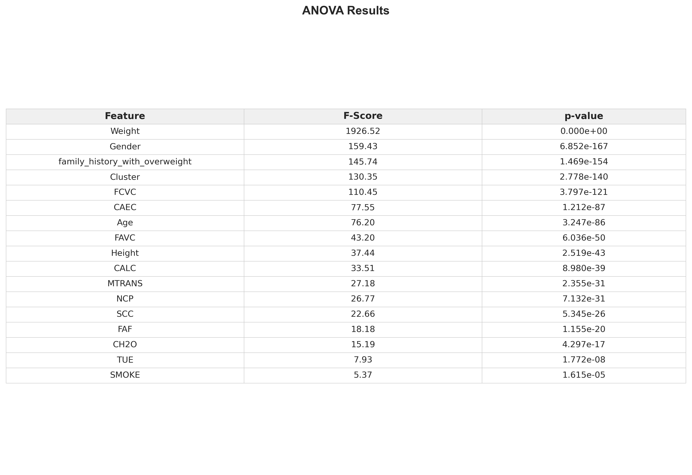
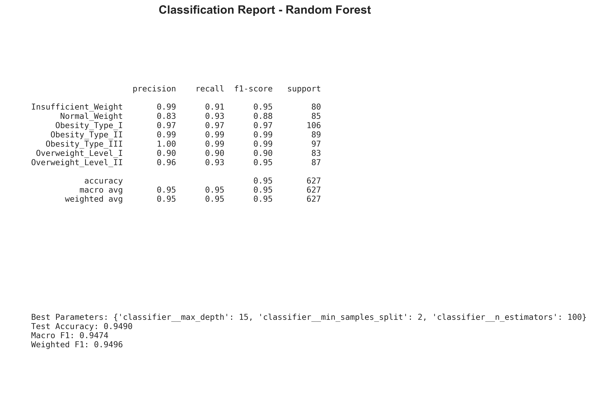
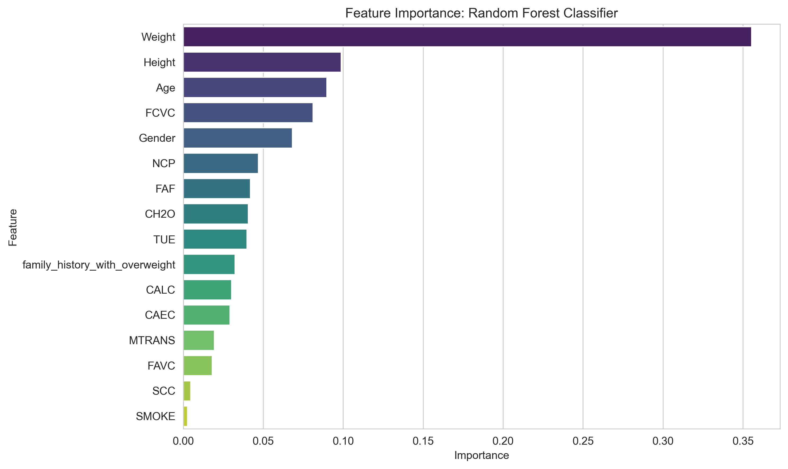

# END-TO-END ML PROJECT: Predicting obesity risk to uncover key risk factors and population subgroups for actionable public health intervention

## Project Overview

Obesity is a global health crisis affecting over 600 million people worldwide. Traditional assessment requires clinical measurements, limiting access. This project applies machine learning models notably Random Forest, Decision Tree, and Logistic Regression through classification, regression, and clustering to predict obesity levels using **self-reported eating habits and physical activity**, enabling cost-effective, scalable approach to large-scale screening.

## Data Sources
The dataset include data for the estimation of obesity levels in individuals from the countries of Mexico, Peru and Colombia, based on their eating habits and physical condition. It contains **2,111 records** (real  and synthetic) with 16 features. Target variable: **NObeyesdad** (7 obesity levels).

| Category | Features |
|----------|----------|
| Demographic | Gender, Age, Height, Weight, family_history_with_overweight |
| Eating habits | FAVC (high-calorie food), FCVC (veg frequency), NCP (meals/day), CAEC (between meals), CH2O (water), CALC (alcohol) |
| Physical condition | SMOKE, SCC (calories monitoring), FAF (activity frequency), TUE (tech use), MTRANS (transportation) |

**source:** [UC IRVINE MACHINE LEARNING REPOSITORY](https://archive.ics.uci.edu/dataset/544/estimation+of+obesity+levels+based+on+eating+habits+and+physical+condition)

---

## Tools & Libraries

- **Jupyter Notebook** – programming language  
- **pandas, numpy** – data manipulation  
- **matplotlib, seaborn** – visualization  
- **scikit-learn** – preprocessing, modeling, and evaluation  

---

## Data Cleaning & Preprocessing

- No missing values – dataset was complete.  
- Duplicates removed (Number of duplicate rows: 24).  
- Categorical variables label-encoded.  
- Created continuous BMI feature for regression.  
- Train-test split: 70/30 with stratification for classification.

## EXPLORATORY DATA ANALYSIS (EDA)

### Target Distribution
**Insights:**

The data is relatively balanced, however, obesity level (Insufficient_Weight) has the fewer samples. So I used stratification during train-test split to split to preserve proportions.

### Correlation Matrix
**Observations:**

- BMI and weight are highly correlated since BMI = weight/ (height)^2.
- FCVC (vegetable consumption) and TUE show moderate negative correlation with BMI, and
- Age has a small positive correlation with BMI
  
So there was a need to drop BMI (because is derived from weight and height) to prevent multicolinearity, which could lead to unstable model coefficients, reduced interpretability, and redundant information

### ANOVA F-Test
**Insights:**

**This test shows how well each feature alone linearly sepaprates the classes**
- All features are statistically significat (p-value < 0.05). 
- However, weight is the most strongly associated feature with obesity levels, followed by gender, family history with overweight, FCVC, CAEC, Age, and FAVC.
- Factors such as Height, CALC, MTRANS, NCP, SCC, FAF, and CH2O
demonstrate moderate inluence, while 
- Behavioral featues like SMOKE and TUE exhibit weaker associations.

  

## Classification Modelling

### Classification Report (Best Model)
**Insights:**

The observvation reveals that, Random Forest acheives approximately 95% accuracy, macro F1 score, and weighted F1 scores. Which outperforms both the Logistic Regression and Decision Tree models.

### Feature Importance
**Insights:**

- Weight is the dominant predictor, followed by Height, Age, and FCVC.
- Low importance of family_history and CALC indicates their effects are captured indirectly by other features unlike the results from the ANOVA F test
This observation (RF Feature importantce) shows how much each feature actually contributes to the trained modls's decisions (capturing non-linear effects and interactions)

## Regression Modelling

I employed L2 regularization (Ridge) and Linear Regression for the regression modeling since features are already scaled for these models

**Insights:**

Both regression models achieve near-perfect fit (R^2 = 0.988, MSE = 0.77), indicating that BMI is fully determined by the available predictors. Ridge regression offers no improvement over ordinary least squares, confirming no problematic multicolinearity or overfitting 
